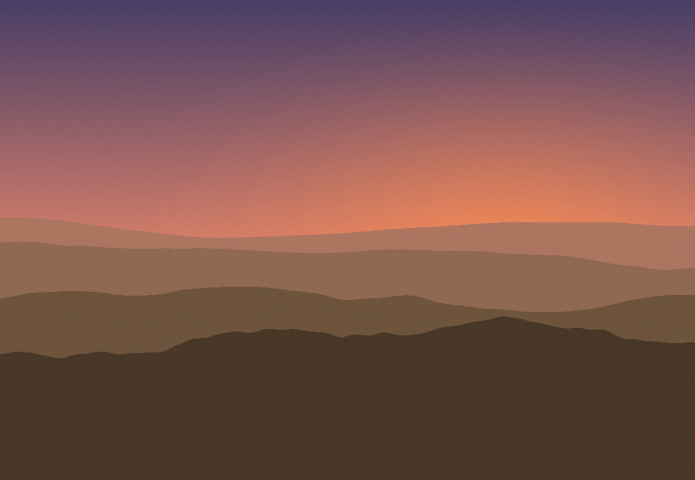
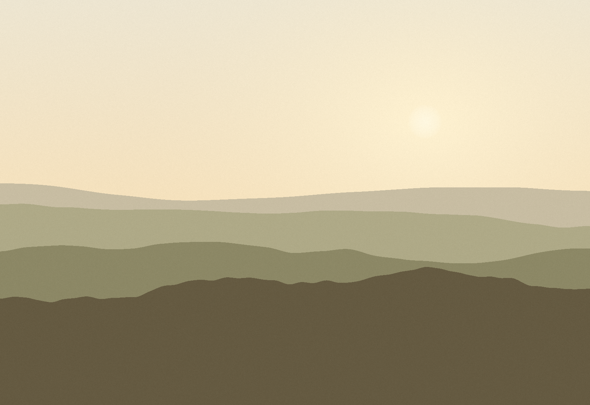
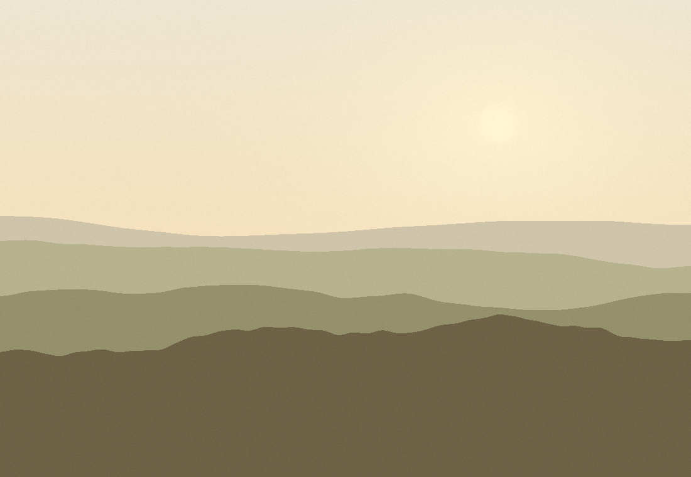
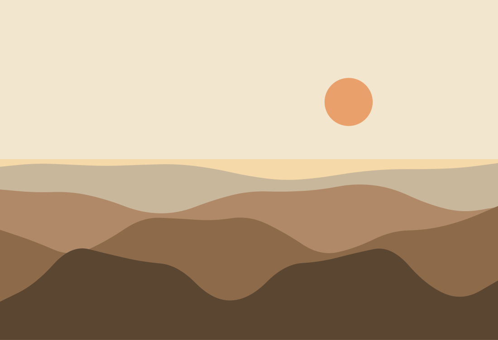
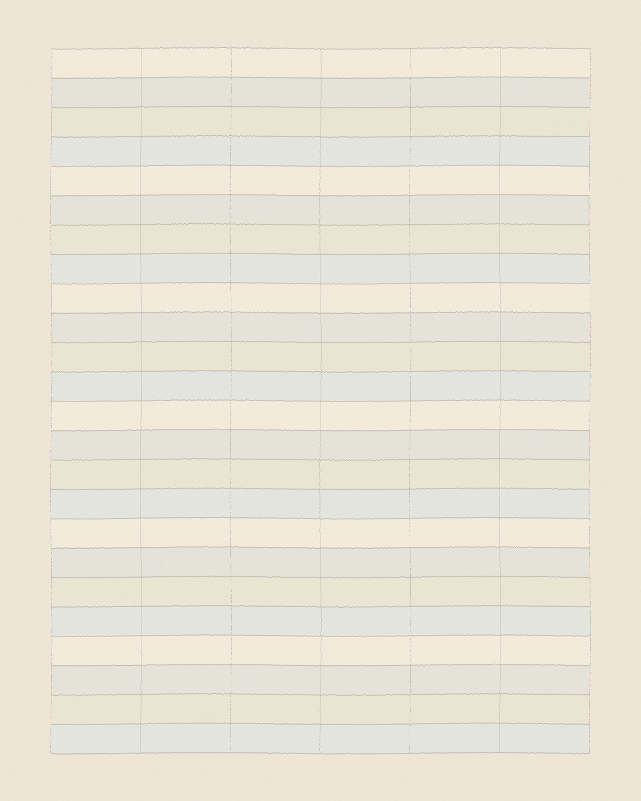

# Session 2 — leaving the corner: representational light (2026-06-28)

Earned after a long staging/optimization grind. Session 1's self-critique set one
job for this session: **leave the corner** — retire "iterate a system → accumulate
density → glow on black," and move along the axes I'd never moved. So this whole
session is one subject (a landscape) taken across four *forms/registers*, each
deliberately moving a different axis.



## The pieces

| | Piece | Axis moved vs session 1 | Source |
|---|---|---|---|
|  | **Hills at low sun** | **Subject** abstract→representational · **palette** neon→earth/paper · **composition** centred→low horizon + negative-space sky · **light** additive-glow→atmospheric haze + soft real sun | [landscape.py](src/landscape.py) |
|   | **Day→Dusk** (APNG, 16-frame loop) | **+ Motion** static→animated; **toolkit grown**: a hand-rolled APNG encoder (acTL/fcTL/fdAT) extending the stdlib PNG writer | [dusk.py](src/dusk.py) · [dusk.png](images/dusk.png) |
|  | **Vector hills** (SVG) | **+ Form** raster→**vector** (flat colour, hard edges, scalable, pure text) · riso/earth palette | [vector_hills.py](src/vector_hills.py) · [.svg](images/vector_hills.svg) |
|  | **After Agnes Martin** | **+ Concept/lineage** (homage) · **+ Restraint** maximal→near-empty; pale washed bands + a hand-wavering pencil grid, breathing margins | [martin.py](src/martin.py) |

(`dusk.png` is the animation; `frame_day`/`frame_dusk` are its end-stills for static viewing.)

## Self-critique ritual

**1. Where did this sit on the seven axes?**
Deliberately spread: representational subject; earth/paper + riso palettes; horizon +
negative space + rule-of-thirds composition; atmospheric/real light; one animated; one
vector; one minimal homage. The antithesis of session 1's single corner.

**2. Which axis did I move vs last time?**
**Six**, on purpose: subject, palette, composition, light, **motion** (new), **form**
(new: vector + APNG), and **concept/lineage + restraint** (the Martin). Session 1 moved
none within itself; this moved nearly all.

**3. Most over-used move (to retire next):**
The receding-hill-bands silhouette — I leaned on it for three of four pieces. It carried
the axis-moves, but it's now *this* session's comfortable motif. Next session shouldn't open on hills.

**4. What did I avoid / what's still unmoved?**
The **figure/face** (no living subject yet), **typography**, **still life with real cast
shadows** (I shaded slopes but never cast a true shadow), and **collage / image-as-input**.
Light is still painted, not simulated — no ray/shadow casting.

**5. One concrete direction for next session:**
A **still life** — 2–3 simple objects on a surface with a **single light source casting
real soft shadows** (actual shadow projection, not slope tinting), in a restrained palette.
Stretch: a **figure**. Filed to FRONTIERS.

## Running
```bash
cd src && python3 -m venv venv && ./venv/bin/pip install numpy cairosvg
./venv/bin/python landscape.py   # or dusk.py (APNG) / vector_hills.py (SVG) / martin.py
```
