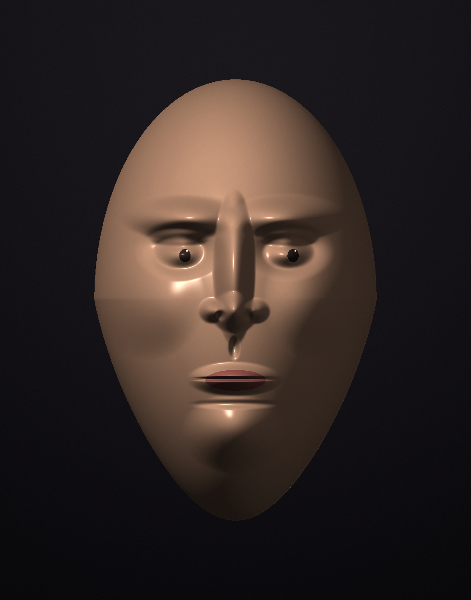
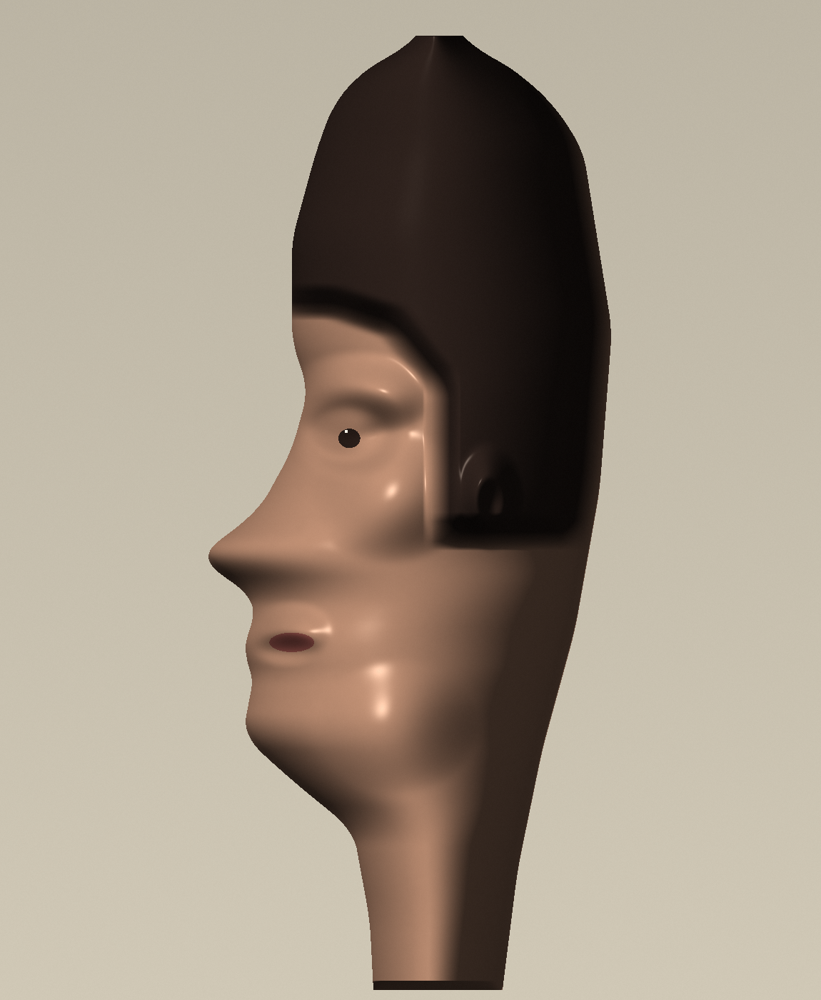

# Session 3 — the face (2026-06-28)

A short focused session (a redirect mid-grind: "iterate on persistence-of-vision").
One job: move the marquee axis the first two sessions never touched — **the
portrait / face** (FRONTIERS up-next #2; session 2's critique literally asked for
"a profile/portrait, so it reads unmistakably"). And do it by *extending* technique,
not repeating one. **Two pieces**: a frontal relief portrait — then, instead of
just *filing* its critique ("next face should be a 3/4 or profile, asymmetric"), I
answered it in the same session with a **profile head**.

 

## The pieces

| | Piece | Axis moved | Technique | Source |
|---|---|---|---|---|
|  | **Bas-relief head** (frontal) | **+ Subject: the FACE/PORTRAIT** (never attempted) | **Relief sculpting**: a height field `z(x,y)` composed from facial structures (dome → brow → nose ridge/bulb/alae → eye sockets + eyeballs → cheeks → a single lip-mass split by one groove → chin, with a jaw taper), then **normals from the height gradient** (`np.gradient`) → Lambert + soft specular + fill under one key light. Skin albedo with darker iris, redder lips, eye **catchlights**. | [portrait.py](src/portrait.py) |
|  | **Profile head** | **+ breaks my own symmetry habit**: asymmetric, side-on | Same relief tech, but a profile is defined by its **front CONTOUR**: per row the head spans `[front(t), back(t)]` interpolated from control points (the nose protrudes on the front edge), with a smoothly-feathered raised dark hair mass. Interior relief: brow, recessed eye + eyeball, cheekbone, ear, lips, jaw. | [profile.py](src/profile.py) |

Both read unmistakably as faces — a solemn archaic mask (Brâncuși / Modigliani
register) and an elongated profile. The bar was "reads as a face on the hardest
subject"; met twice, frontal and side-on.

## How they got there (iterate-to-coherence)

Same discipline as session 2's figure: render → find the lie → fix → repeat.

**Frontal portrait (3 passes):**
1. **v1** — read as a face immediately, but the mouth was two stacked sausages and
   the nostrils were melty blobs.
2. **v2** — softened/widened the nose; pulled the lips together. Mouth *still*
   doubled (modelling upper + lower as two separate mounds guarantees a gap).
3. **v3** — the real fix: model the mouth as **one** lip swell split by a **single**
   thin groove (lips meet at a line and connect at the corners), and widen the chin
   so no bright sulcus band fakes a second mouth.

**Profile (4 passes):**
1. **v1** — recognisably a profile, but a faceted witch-hat crown, a hard hairline
   cut, the eye too high/forward, and a melting banded lower face.
2. **v2** — feathered the hair mass (blurred boolean → smooth), lowered/set-back the
   eye, tamed the specular. Better, but the crown still peaked and the cheek/neck
   still banded.
3. **v3** — rounded the skull (more crown control points), shortened the neck.
4. **v4** — the real bug: the **contours were piecewise-linear**, so `np.interp` left
   a slope crease at every control-point row and the cross-section turned each crease
   into a horizontal ridge — *that* was the "melt". **Smoothing the 1-D contour
   curves** before building the cross-section removed it. (The session-2-figure lesson
   again: the artifact had one structural cause, not ten cosmetic ones.)

## Self-critique ritual

**1. Which axis moved?** Subject → **the face**, the last marquee axis untouched
across sessions 1–2 — moved twice, **frontal and profile**. Technique grew too: from
"computed light on *given* volumes" (still life / figure) to **sculpting the volume
itself** as a relief height field, then adapting that to a **contour-defined** profile.

**2. What works:** both read as faces without a caption; the eyes (socket recess +
raised eyeball + dark iris + catchlight) and the unified mouth carry the frontal; the
protruding-nose contour + swept hair carry the profile. Gradient-normal relief gives
believable soft form and sheen.

**3. What's still weak (for next time):** the frontal is **symmetric and mask-stiff**
(a shallow medallion, not a full head); the profile is elegant but **elongated and
mannequin-blank** — no expression, no real individuality, hair is a flat dark mass.
Neither has a true 3/4 (the hardest, most natural view).

**4. Caught & corrected this session:** the **centred-symmetric-subject** habit — the
profile already breaks it. Still un-broken: every piece so far is one isolated subject
on an empty ground.

**5. One concrete direction next:** a **3/4 head with an expression** (the view that
forces real asymmetric structure + mood), *or* the last genuinely-untouched axis —
**image-as-input / collage** (transform a real photo; a full PNG decoder). Filed to
FRONTIERS.

## Running
```bash
cd src && python3 -m venv venv && ./venv/bin/pip install numpy
./venv/bin/python portrait.py   # frontal — writes portrait.png
./venv/bin/python profile.py    # profile — writes profile.png
```
