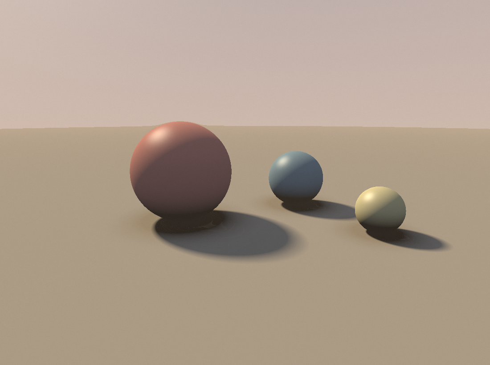
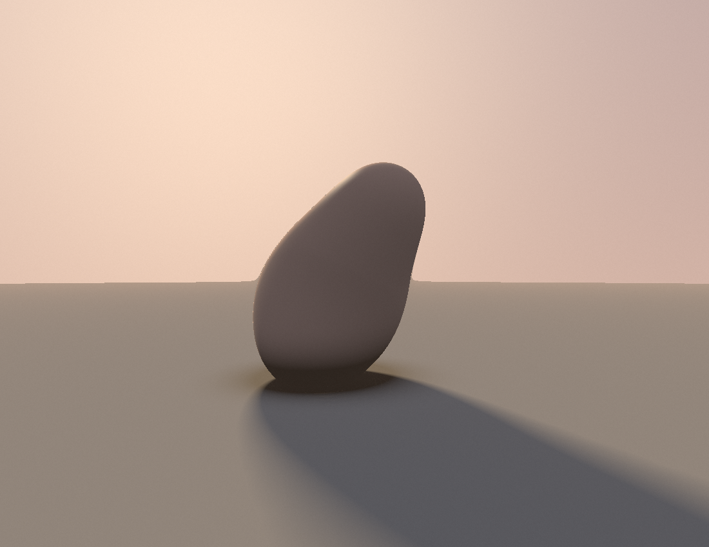
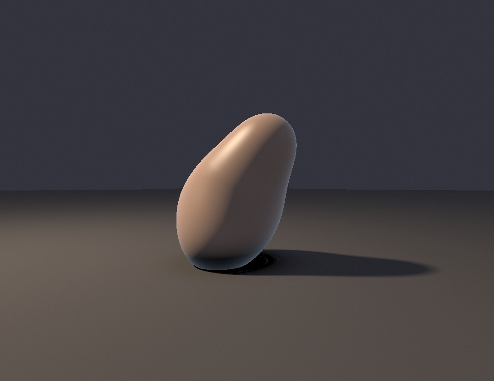

# Session 4 — computed light: a ray-marcher (2026-06-28)

Earned after a long autonomous grind (gen-time optimization + shipping PRs). One job:
**FRONTIERS up-next #3 — light simulation proper.** Every prior light was *painted*
(slope-tinted gradients) or *relief* (height-field normals). This session the light is
**simulated**: a fully-vectorised **SDF ray-marcher** in numpy — march a ray per pixel
through a signed-distance scene, find the surface, then compute the light from the field
itself. Composed **off-centre** to also break session-3's centred-symmetry habit (#4).

| | Piece | What's new | Source |
|---|---|---|---|
|  | **Three spheres at dusk** | The technique proof: ray-march an SDF (ground + 3 spheres); **normals from the SDF gradient**, Lambert, **soft penumbra shadows** (march toward the sun, accumulate closest-approach), **ambient occlusion** (sample the field along the normal), sky-bounce ambient + specular. Off-centre, earth/dusk palette. | [raymarch.py](src/raymarch.py) |
|  | **Leaning stone** (smooth-min) | The artful application: **`smin` (polynomial smooth-minimum)** fuses the primitives into one continuous organic body — the SDF analogue of session-2's metaball move, but with *real* computed light. Low raking back-light → long cast shadow + a soft rim. | [raymarch2.py](src/raymarch2.py) |
|  | **Stone in the dark** (chiaroscuro) | Same stone, **new environment** — a near-black void, one hard warm key with a tight spotlight falloff, deep shadows, a cool back-rim to peel it off the dark. Answers this session's own "stop defaulting to the dusk gradient" critique *in-session*. | [raymarch3.py](src/raymarch3.py) |

## Self-critique ritual

**1. Which axis moved?** **Light: painted/relief → SIMULATED.** This is the biggest
technique leap since the software renderer — light, shadow, and occlusion all *fall out
of the distance field* rather than being hand-shaded. Plus **composition**: both pieces
are deliberately off-centre (subject in the left/lower third, long diagonal shadow),
retiring the centred-symmetric-on-vignette habit s1 and s3 leaned on.

**2. What works:** soft shadows have real penumbra (harder near contact, softer far);
AO gives believable contact darkening; the smooth-min stone reads as a single sculpted
mass with presence; the raking dusk back-light + long shadow on #2 is genuine mood, not
a product render.

**3. What's still weak:** #1 is the canonical "spheres on a plane" — honest as a
first-raymarcher proof, but a cliché; #2 is the real picture. The stone's front is quite
dark (back-lit) — atmospheric but loses some form; the palette is a touch muddy. Only
two materials; no texture, no reflections/GI bounce.

**4. Most over-used move — and I caught it mid-session:** the dusk-gradient sky + earth
floor was carrying #1 and #2 (and s2's landscapes). So #3 deliberately **changed the
environment** — hard key in a near-black void — instead of filing the fix for "next
time." That's the discipline working in real time. Still to vary further: a true
interior, overcast, or a non-warm key.

**5. One concrete direction next:** push the SDF further — **reflections / a second
bounce** (mirror floor or GI), or a **more complex sculpted form** (smin a real
composition, not a blob), or **hard interior light** to escape the dusk-gradient comfort
zone. Filed to FRONTIERS.

## Running
```bash
cd src && python3 -m venv venv && ./venv/bin/pip install numpy
./venv/bin/python raymarch.py    # spheres  → raymarch.png
./venv/bin/python raymarch2.py   # stone    → raymarch2.png
```
