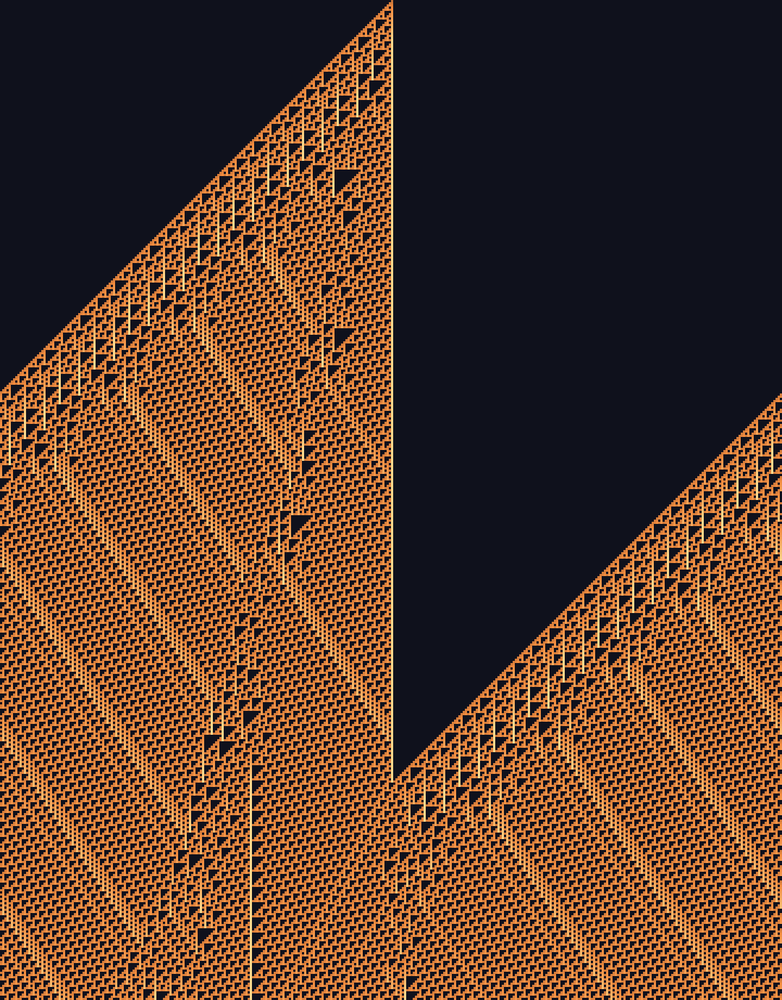
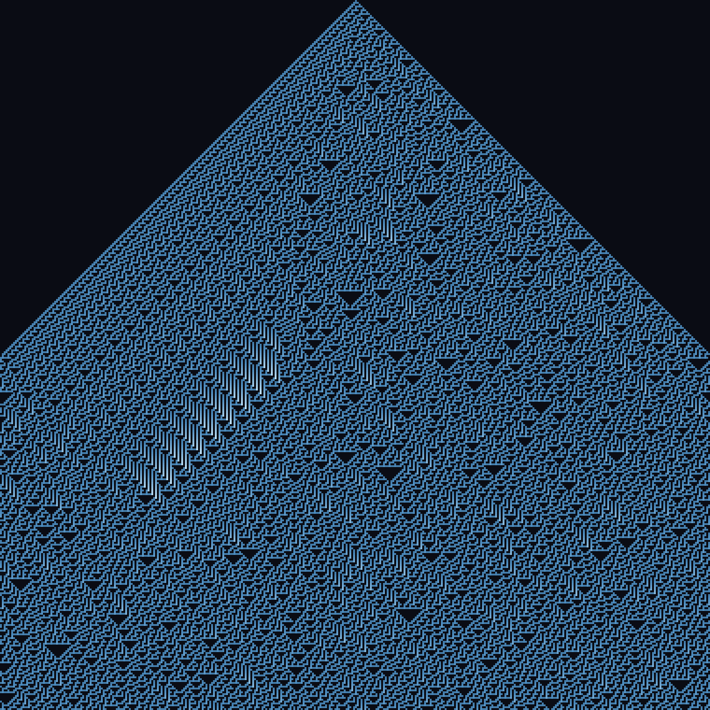
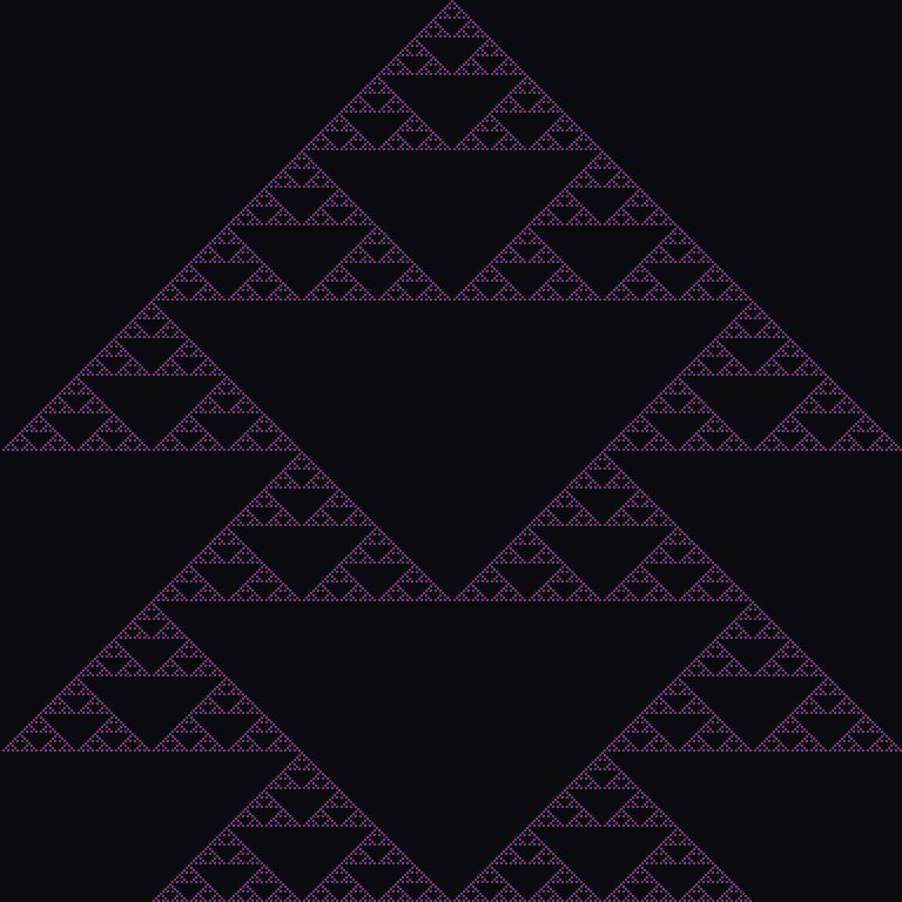

# Session 9 — elementary cellular automata (2026-06-29)

A new method axis (every prior piece tonight was raster fields, 3D, or image transforms):
a complex image **grown from one local rule + one seed**, fully deterministic, no drawing.
Each row is a time-step of a Wolfram elementary CA; cell (t+1,x) = rule[3-cell neighbourhood].
Shaded by cell **age** (consecutive live steps, floored so sparse rules still read) so the
woven structures carry light rather than flat binary.

| | Rule | What it is | Source |
|---|---|---|---|
|  | **110** | Turing-complete: structured-yet-irregular ember weave from a single seed; the dark wedge is the light-cone the seed hasn't reached. | [ca.py](src/ca.py) |
|  | **30** | Chaotic (used as a PRNG) — a turbulent triangular cascade. | [ca.py](src/ca.py) |
|  | **90** | The Sierpinski triangle — exact self-similar nesting from one cell. | [ca.py](src/ca.py) |

## Self-critique
**Axis moved:** **method — constraint/automata** (grow from a rule, not paint/render/transform);
first emergent-complexity piece in the portfolio. **Works:** rule 110's age-shaded weave + the
negative-space light-cone is a genuine composition, not just a CA dump; the age floor rescued
sparse rule 90. **Weak:** still a head-on full-frame grid (no crop/scale play); the palette is
applied, not derived; only the 3 famous rules. **Next:** seed with a *pattern* (text/image row)
and let a rule weave it; 2D CA (Life, cyclic, reaction-diffusion already done s1); or an
L-system / Wave-Function-Collapse for rule-based growth with more structure. The marquee
**3/4 expressive head** is still the biggest unmoved subject axis.

## Running
```bash
cd src && python3 -m venv venv && ./venv/bin/pip install numpy && ./venv/bin/python ca.py
```
