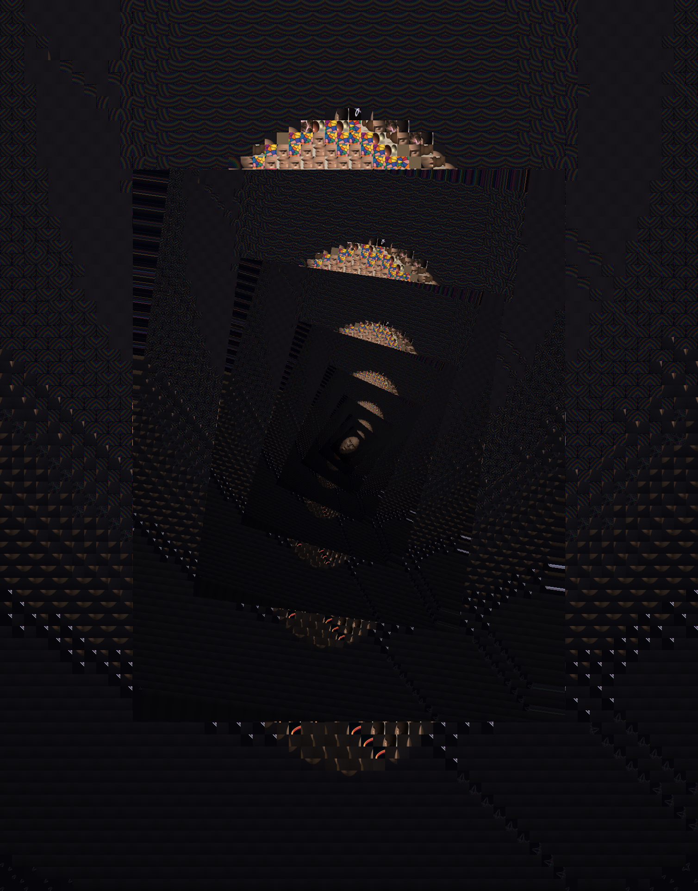
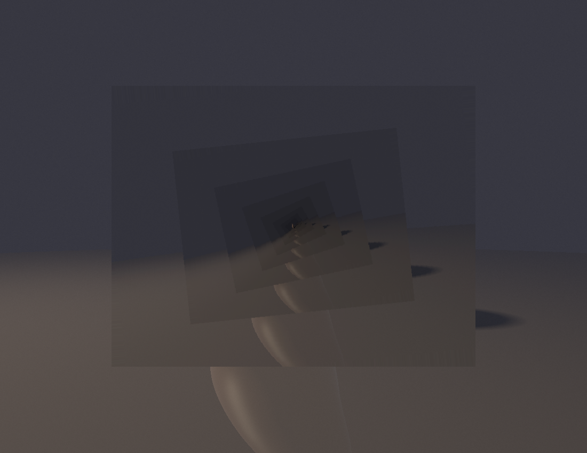

# Session 7 — Droste recursion: an image inside itself (2026-06-29)

A second image-as-input transform (FRONTIERS up-next #2), and a tight reward mid-way through
a long engineering night. Where session 5's mosaic *composed* one image from many and
session 6's pixel-sort *deranged* an image's order, this one makes an image **contain
itself**: paste a shrunk + rotated + darkened copy of the whole picture into a window inside
it, N levels deep, opening an infinite recursive tunnel. The literal "persistence of vision"
— vision nested within vision.

| | Piece | What's new | Source |
|---|---|---|---|
|  | **Vortex of selves** | The session-5 corpus-portrait nested 7 deep with an 8°/level twist — a dark spiral tunnel where each level's rainbow-tile "crown" catches light receding into shadow. | [droste.py](src/droste.py) |
|  | **Window in window** | The reflected stone nested 8 deep, counter-rotated −6°/level — a soft luminous frame-within-frame, the stone's curve sweeping through the tunnel. | [droste.py](src/droste.py) `stone` |

## Self-critique ritual
**1. Axis moved:** **method — recursion/Droste** (a 3rd distinct image-as-input mode after
compose + derange), plus a real bilinear resize + center-rotation in numpy (toolkit growth).
**2. Works:** the per-level twist turns a flat picture-in-picture into a genuine vortex; the
recurring bright crowns in the mosaic version give the spiral a rhythm. **3. Weak:** the
mosaic source is dark, so the compounding `dim` makes the tunnel murky fast — should brighten
deeper levels, not darken; the window is a fixed centred box (no off-axis vanishing point);
no true log-spiral conformal "Droste effect" (the real McEscher/Escher-Droste warp), just
discrete nesting. **4. Over-used:** still feeding on my own portfolio — next image-input piece
should ingest something external. **5. Next:** brighten-with-depth, an off-centre vanishing
point, or the genuine conformal log-spiral mapping; and the still-open **3/4 expressive head**.

## Running
```bash
cd src && python3 -m venv venv && ./venv/bin/pip install numpy
./venv/bin/python droste.py all   # -> images/droste_{mosaic,stone}.png
```
