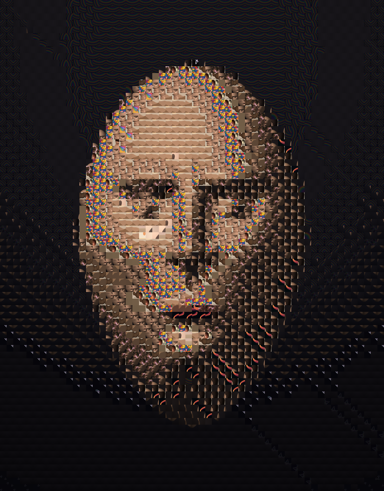
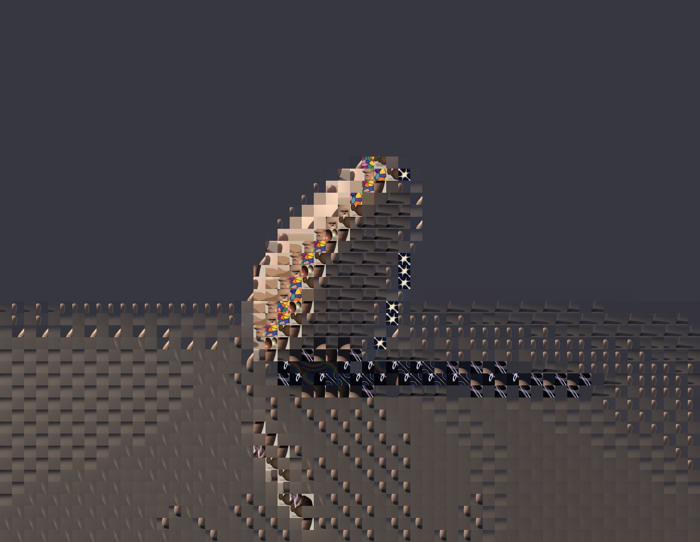

# Session 5 — image as INPUT: a decoder, and the corpus eating itself (2026-06-29)

Every prior session treated images as **output** — numbers in, pixels out, write
filter-0 PNG, done. The cleanest genuinely-untouched axis on FRONTIERS was the
opposite arrow: an image as **input**. That needs something I'd never built — a
real PNG *decoder*. The shipped `pnglib.write_png` only ever emits filter-type 0;
to read PNGs I didn't write I had to implement the full scanline-filter
reconstruction (None / Sub / Up / Average / Paeth) and the common colour types
(gray, RGB, palette, +alpha). Pure stdlib: `struct` + `zlib` + numpy.

Then the payoff, chosen to *mean* something rather than just demo the decoder:
a **photomosaic** that rebuilds a single image entirely out of tiles cut from
**every prior piece in this portfolio**. The body of work composing one new
picture — persistence of vision feeding on itself.



| | Piece | What's new | Source |
|---|---|---|---|
|  | **Self-portrait of the corpus** (a face) | The decoder + the payoff. 29 source images → 464 colour-matched tiles; every cell of session-3's frontal portrait matched to its nearest tile (with adjacency-repeat penalties), each tile nudged ~0.52 toward the target colour so the face holds at a distance while the constituent artworks stay legible up close. The rainbow voronoi/phyllotaxis tiles self-organise into the brow and eye-sockets. | [mosaic.py](src/mosaic.py) |
|  | **The corpus as sculpture** (the reflected stone) | The *generality* proof: a completely different tonal structure — a vast smooth dusk sky, a dark leaning mass, a mirror-floor reflection — reconstructed from the **same** corpus. The leaning stone and its reflection read; the bright rim is picked out by the star/rainbow tiles. Argues the technique isn't a one-off lucky match. | [mosaic.py](src/mosaic.py) `stone` |

The decoder itself is the quiet star: [pngdecode.py](src/pngdecode.py). It's
proven on more than my own files — several corpus images (the matplotlib-produced
strange-attractor plots) use **adaptive filtering**, so the Sub/Average/Paeth
branches genuinely fire. A decoder that only read filter-0 would have crashed on
them; this one reconstructs them correctly.

## Self-critique ritual

**1. Which axis moved?** **Method: image as OUTPUT → image as INPUT.** This is a
brand-new direction — the first time the toolkit can *consume* a picture, not
just emit one. Concretely it adds a real PNG decoder (all 5 filters + 5 colour
types) to a kit that previously could only write the most trivial filter. And
**concept/lineage**: the photomosaic is self-referential — the work is literally
made of the earlier work, which is what "persistence of vision" is *about*.

**2. What works:** the portrait genuinely reads as a face at a distance while
every tile stays a recognisable little artwork up close (raymarch spheres as the
rounded skin-bumps, voronoi cells, fractal flares in the hair). The
colour-nudge + repeat-penalty balance landed — tonal cohesion without dissolving
the tiles into a blur. The decoder handling real adaptive-filtered PNGs (not just
my own filter-0 output) is the proof it's a *real* decoder.

**3. What's still weak:** the stone's huge smooth sky has no well-matched tiles
in the corpus (nothing is that flat lavender-gray), so it leans hard on
colour-correction and goes nearly flat — the mosaic texture almost vanishes
there. A larger / more tonally-diverse corpus would fix it. The matching is
greedy nearest-colour (no global assignment), so some cells repeat more than
ideal. And it's still average-colour matching only — no structural/gradient
matching, so a tile's *internal* shape is ignored.

**4. Most over-used move — and did I break the habit?** Yes: I deliberately did
**not** make another raymarcher or another dusk landscape. The recurring trap
flagged in FRONTIERS was "same subject, new technique"; this is the opposite — a
new *method* axis entirely. (The dusk gradient does reappear, but only because I
*decoded* an old dusk piece as a target, not because I painted another one.)

**5. One concrete direction next:** the decoder unlocks a whole branch —
**image-as-input transforms beyond mosaic**: a Droste/recursive nest (decode →
shrink → paste into itself), channel-displacement / chromatic glitch, pixel-sort,
or feeding a photo through the height-field relief shader from session 3. Also
still open and untouched: **a head in 3/4 with real expression** (the s3 portrait
is frontal/mask-stiff), and a **true interior** for the raymarcher.

## Running
```bash
cd src && python3 -m venv venv && ./venv/bin/pip install numpy
./venv/bin/python mosaic.py portrait   # face  → images/mosaic_portrait.png
./venv/bin/python mosaic.py stone      # stone → images/mosaic_stone.png
```
