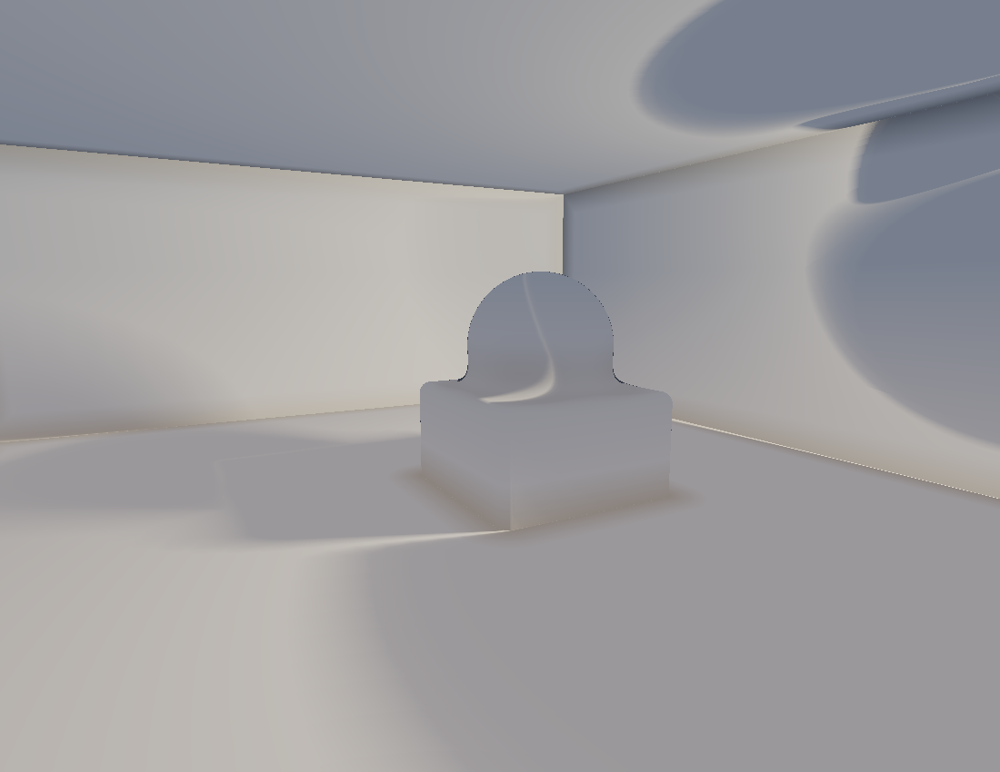

# Session 8 — a true interior (2026-06-29)

A tight reward between engineering stretches, and a deliberate **habit-break**: every prior
ray-march (s4) and landscape sat in an open dusk void — FRONTIERS kept flagging "change the
*environment*, not just the subject." So this is **enclosed**: a box room (six inward-facing
planes as one SDF), a smin-fused sculpture on a plinth, lit by a single warm key high on the
right wall with **cool fill bounced off the walls** instead of a sky, a soft cast shadow on
the floor, and a near-black void only outside the room. High-key, Turrell-ish — light *in a
room*, not light *in a field*.



## Self-critique
**Axis moved:** **environment — open void → true interior** (walls/ceiling/floor/corner +
bounced fill), the recurring dusk-void habit finally broken; also composition (a corner gives
real depth). **Works:** it reads unmistakably as an enclosed room with a lit object; the
corner + ceiling line sell the enclosure; the warm-key/cool-fill split is gentle but real.
**Weak:** too high-key (the room reads chalky; a darker key + a crisper window-shaft would
give more drama, closer to the s4 chiaroscuro); the "window" is an off-screen point light,
not a visible shaft; only one material. **Next:** a visible volumetric shaft, a lower-key
darker room, or true inter-reflection off the walls. Filed to FRONTIERS.

## Running
```bash
cd src && python3 -m venv venv && ./venv/bin/pip install numpy && ./venv/bin/python interior.py
```
