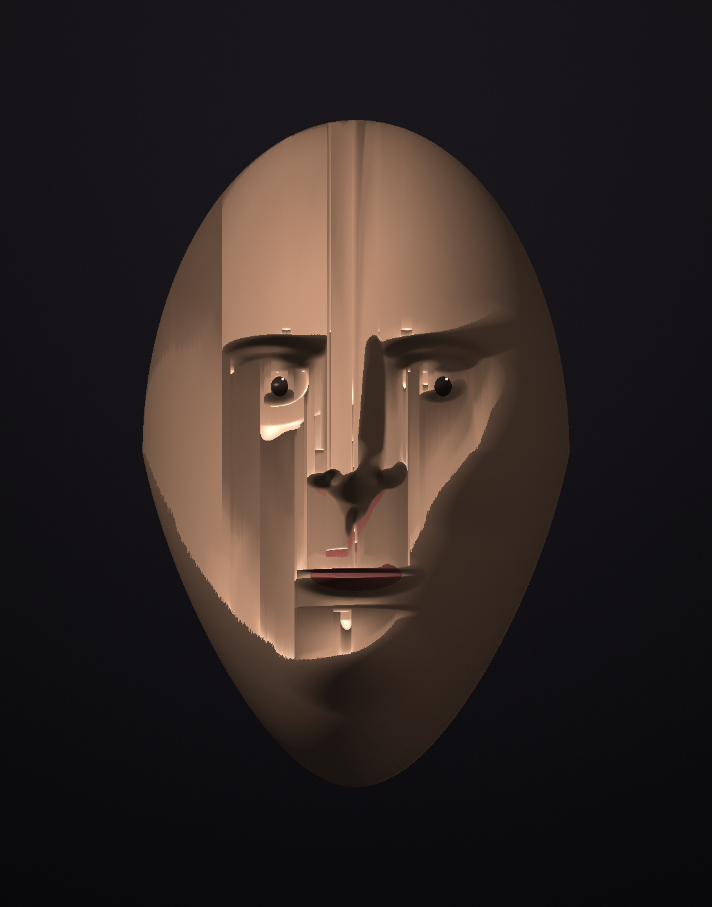
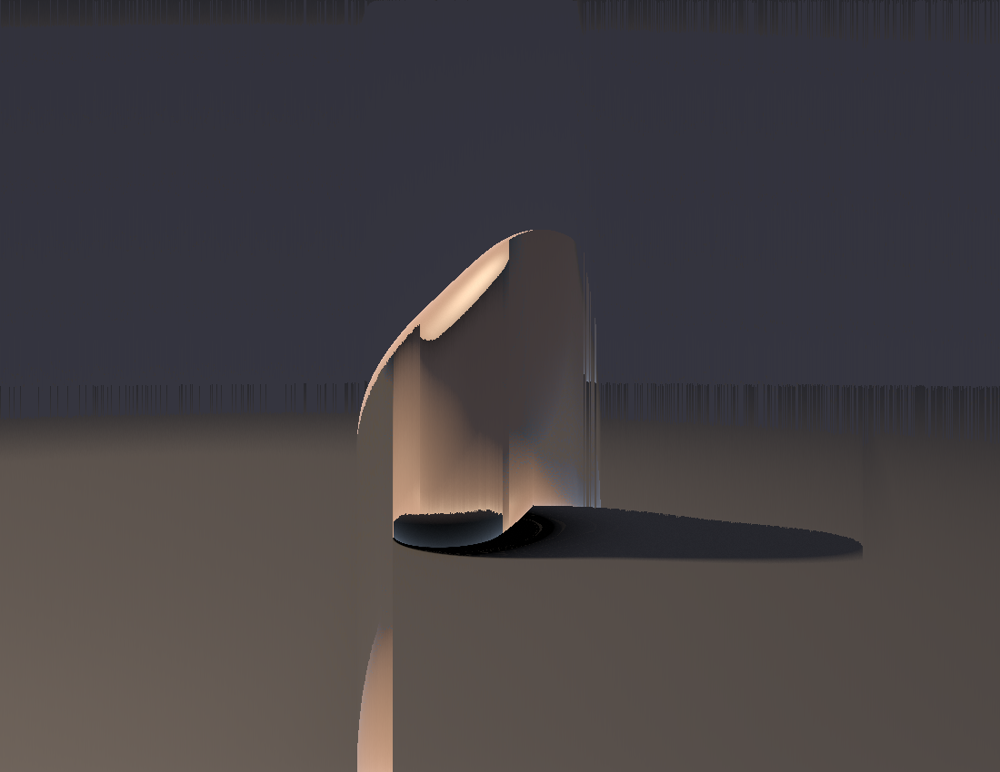
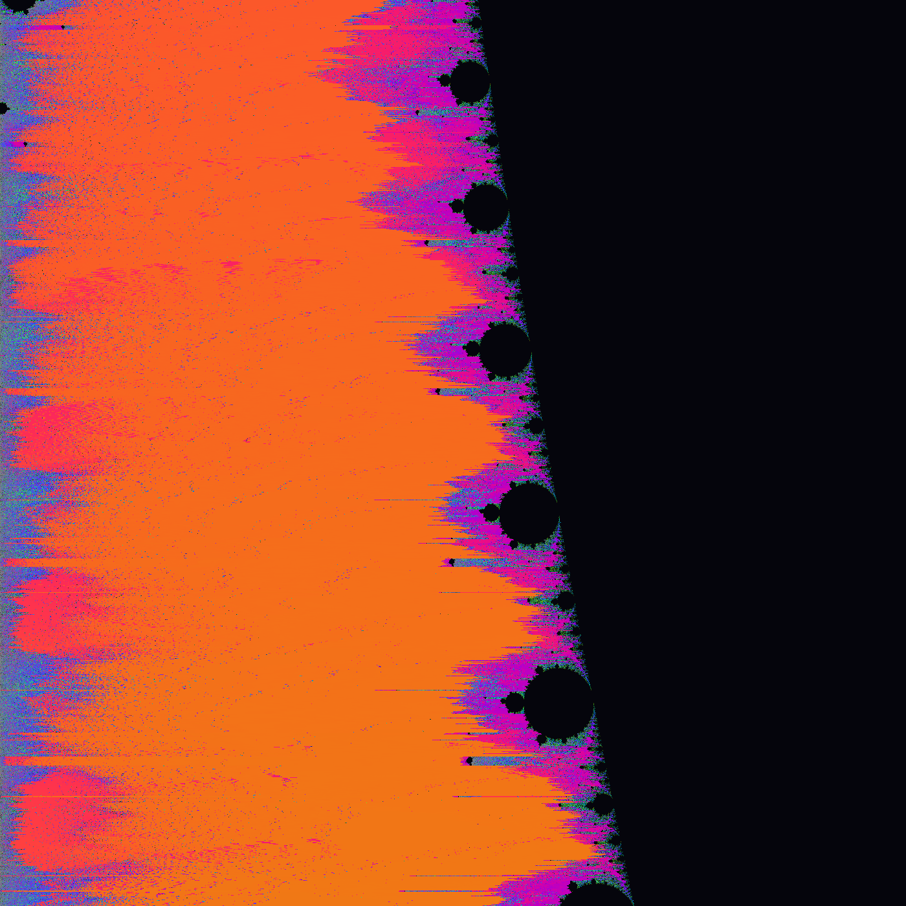

# Session 6 — pixel-sorting: an image-as-input transform (2026-06-29)

Earned mid-way through a long autonomous engineering night. FRONTIERS up-next #2:
**image-as-input transforms BEYOND the mosaic.** Session 5 built the PNG decoder and used
it to *compose* (a photomosaic); this session uses it to *transform* — re-ordering an
existing image's own pixels rather than computing one from scratch. The technique is
classic **pixel-sorting**: within each column (or row), sort contiguous runs of pixels by
brightness, but only where brightness falls inside a threshold band — so mid-tones melt into
glassy streaks while the darkest and brightest pixels stay pinned as anchors. The subjects
are my own prior pieces, fed back in as input.

| | Piece | What's new | Source |
|---|---|---|---|
|  | **Dissolving mask** | Vertical sort of the session-3 relief portrait. Mid-tone facial planes drip downward into columns while the eye catchlights, nostrils and lips (out-of-band darks/reds) stay pinned and the smooth outer face holds its silhouette — a face dissolving from the inside, Bacon-esque. The most arresting of the three. | [pixelsort.py](src/pixelsort.py) |
|  | **Luminous monolith** | Vertical sort of the session-4 chiaroscuro stone. The lit mid-tones flow into a smooth glassy column (a candle-flame/standing-stone reading) with the cast shadow and dark void pinned, and the dusk horizon band combed into fine vertical teeth. | [pixelsort.py](src/pixelsort.py) `stone` |
|  | **Combed set** (hue) | Horizontal sort *by saturation* of the session-1 Mandelbrot. The escape-time bands smear into horizontal sunset streaks while the black set-bulbs (out of band) keep their bulbous edge — fractal turned to flowing water. | [pixelsort.py](src/pixelsort.py) `mandelbrot` |

## Self-critique ritual

**1. Which axis moved?** **Method: image-as-input — compose → TRANSFORM.** Session 5 read
images to build a new one; this re-orders an image's *own* pixels, a genuinely different
use of the decoder. New aesthetic vocabulary too (glitch/dissolution), which the kit hadn't
touched — every prior piece was constructed, never *deranged*.

**2. What works:** the threshold-band idea is the whole trick and it pays off — pinning
out-of-band anchors keeps enough structure that each result still reads as its source
(a face, a stone, the set) while the in-band melt transforms it. The portrait is genuinely
unsettling in a way I didn't fully predict from the code; that surprise is the sign it's
art and not just a filter.

**3. What's still weak:** pure axis-aligned sorting is the most basic pixel-sort — no angled
or flow-guided sweep, no edge-detected interval masks (the bands are global luma thresholds,
not content-aware). The mandelbrot is the weakest: striking color but the horizontal smear
fights the fractal's radial structure. And it's still a *single* deterministic pass — no
layering of sorts, no compositing the sorted result back over the original.

**4. Most over-used move?** Not applicable in the usual sense (new technique), but the trap
I avoided: I did NOT make another raymarcher or mosaic — I moved the method axis. The one
habit creeping in is reaching for my own portfolio as the subject every time; next
image-input piece should ingest something external.

**5. One concrete direction next:** content-aware intervals (sort between detected edges, not
global thresholds), angled/radial sort directions, or compositing sorted+original; and the
still-open marquee subject axis — **a 3/4 head with real expression**. Filed to FRONTIERS.

## Running
```bash
cd src && python3 -m venv venv && ./venv/bin/pip install numpy
./venv/bin/python pixelsort.py all   # -> images/sort_{portrait,stone,mandelbrot}.png
```
