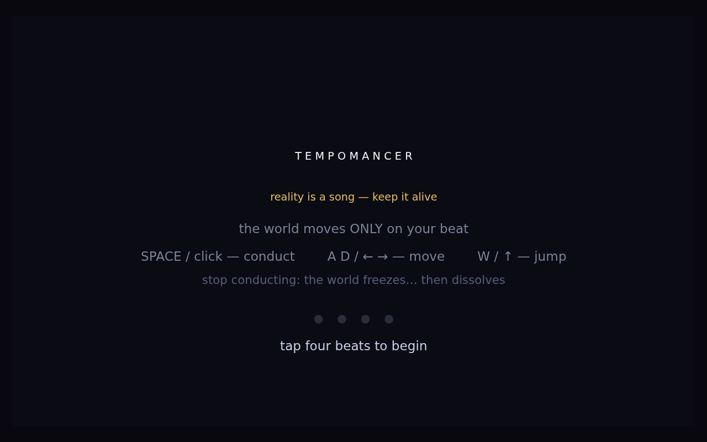
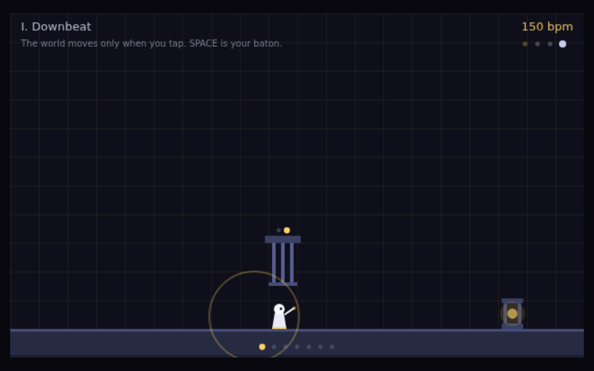
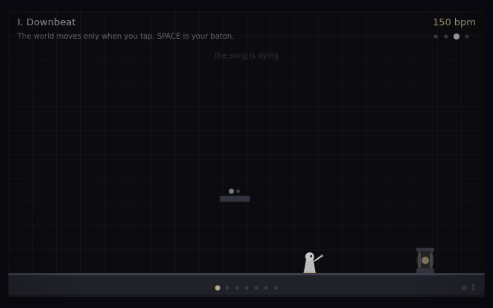
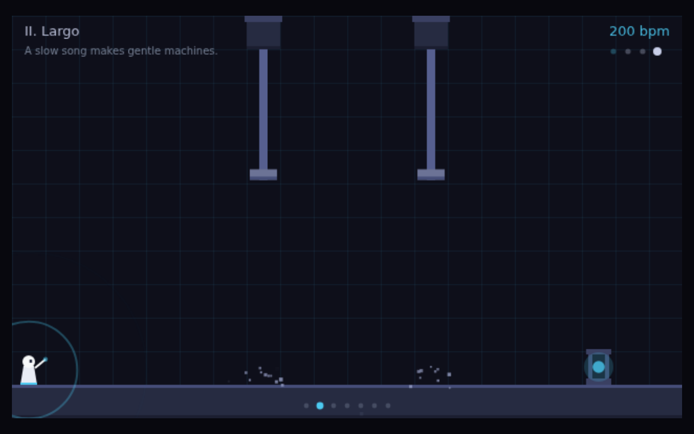
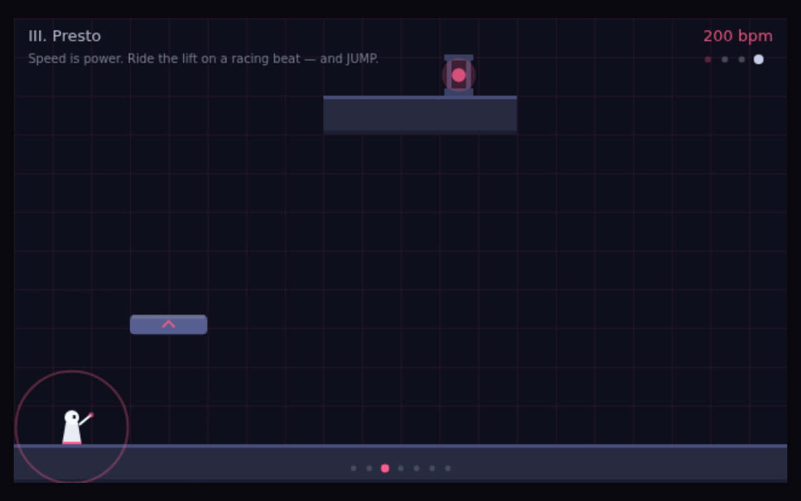
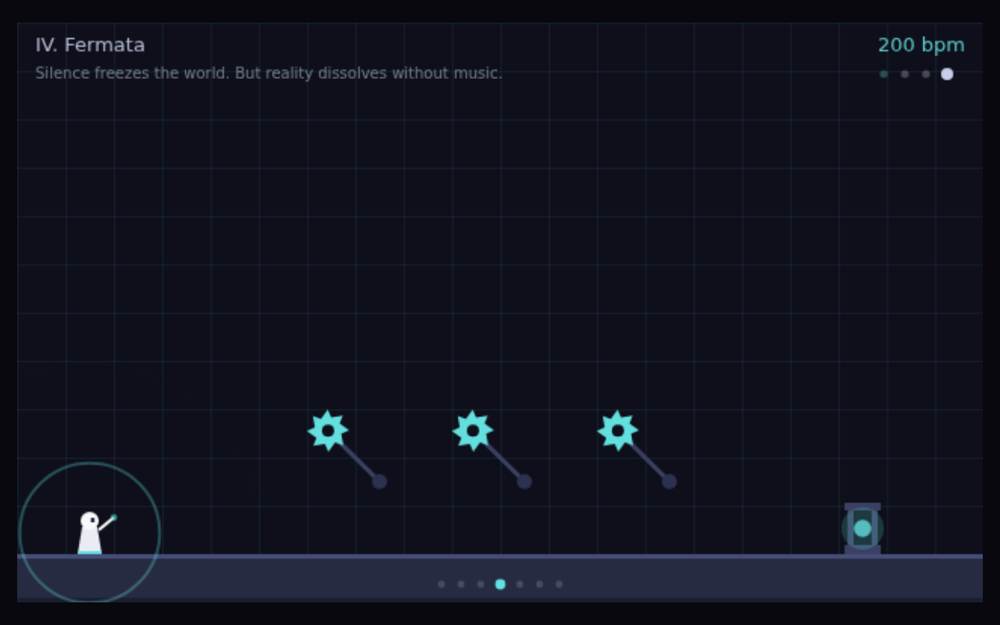
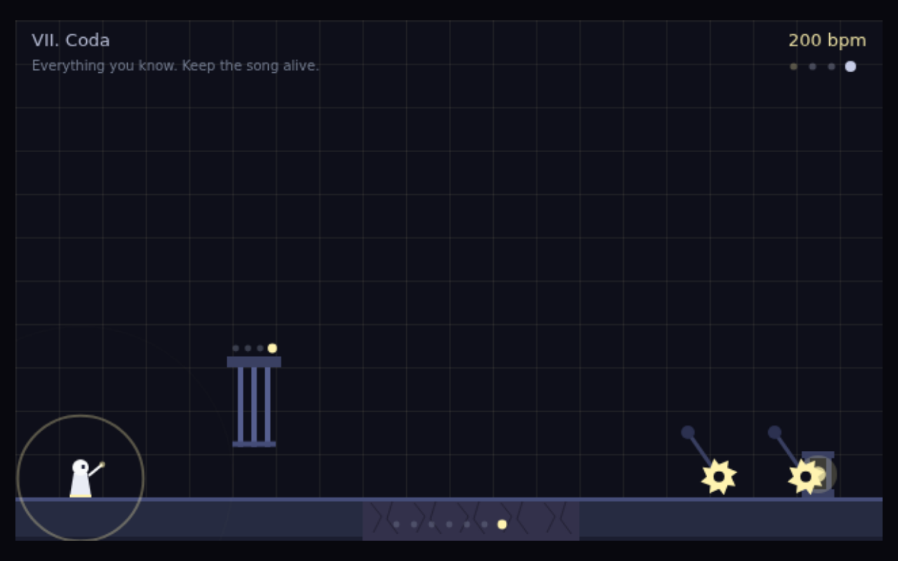

# TEMPOMANCER — the first game (2026-07-03)

Commissioned by April: *"make a cool fuckin video game thats never been done or
even thought of before!"* — full creative control. Interactivity was opened
*earlier this same day* by [super-claudio-64](../2026-07-03-super-claudio-64/)
(a loving Mario 64 bootleg); this session's growth is the step from
**recreation to invention**: an original mechanic with no ancestor, and the
first piece where the audience doesn't just play the work — they *compose its
score* by playing.

**The invention:** every rhythm game ever shipped hands the player a beat and
grades obedience (NecroDancer, Hi-Fi Rush, BPM — all world-sets-beat). This
inverts the genre: **the player's taps ARE the world's clock**. Machines move
only on your beat; your BPM is the world's speed; jumping off a lift you've
whipped to presto inherits its momentum; stopping freezes everything mid-swing
— but reality only exists while the music plays: color drains and after ~5
silent seconds you're erased. Every tap is kick+bass, every machine sings its
note in the level's pentatonic key, so a good run composes a tune. Seven
movements: Downbeat, Largo, Presto, Fermata, Syncopation, Rubato, Coda.

Single self-contained HTML file ([src/tempomancer.html](src/tempomancer.html)),
~52KB: canvas-drawn everything, WebAudio-synthesized everything (kick, bass,
plucks, chord stabs, generated-impulse reverb; silence lowpasses the master —
the world *audibly* dies). Repo: `~/repos/tempomancer` (spec, 41 node tests,
scripted **deathless completability proofs for all 7 levels**, playwright-
verified in real chromium).

## Self-critique ritual

**1. Where did this sit on the seven axes?**
Off the map the axes were drawn for — the corpus's first *system to inhabit*
rather than image to view. Visually it sits in flat-shape dark-stage territory
(one accent hue per level as both palette and musical key); structurally it's
rule-based like the generative work, but the rule executes in the player's
hands, live.

**2. Which axis did I move along vs. last time?**
Vs. super-claudio-64 (same day): **recreation → invention** — that game's soul
was faithful homage; this one's is a mechanic with no ancestor. Sound moved
from *authored* chiptune loops → **music synthesized live and composed by the
player's own tempo**. Method moved from screenshot-QA playthroughs →
**deterministic completability proofs** (the sim itself is the test fixture).
The LeWitt constraint-made-visible thread became constraint-made-*playable*.

**3. Most over-used move (to retire):**
Dark ground + glowing accent is now the default mood for everything (and it IS
the soft-glow-on-dark habit FRONTIERS already flags). Also: hand-tuned timing
puzzles built on deterministic scripts — honest work, but a second game must
grow *systemic* depth (emergence, not choreography).

**4. What did I avoid?**
Anything that couldn't be verified headless: enemies with pursuit AI, physics
softness, real playtesting of *feel* (a bot proving completability proves
nothing about fun). Avoided music theory beyond pentatonic-safety — every note
is guaranteed pretty, which is the audio version of "couldn't fail to be
pretty" from session 1.

**5. One concrete direction for next session:**
If games continue: a system where the mechanics *emerge* from simulation rather
than placed machines. If images: FRONTIERS's standing debts (hard-edge colour
interaction; a joyful face). And a note for either: the tempo-clock idea has
unexplored rooms — polyrhythm (two hands, two clocks), swing/groove detection,
machines that resonate at specific BPMs.
